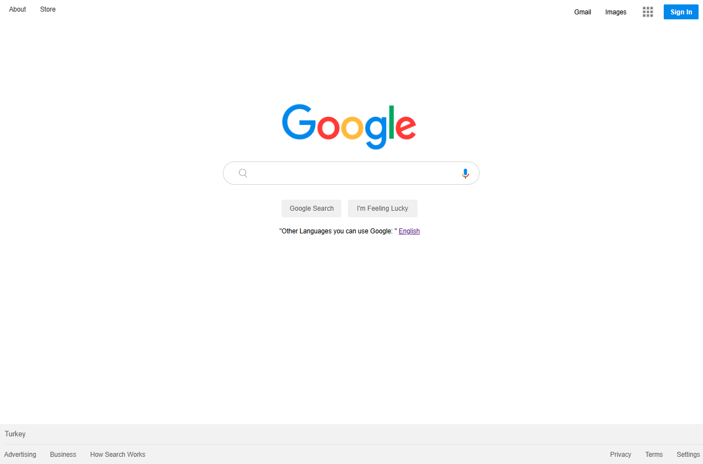

<!-- Please update value in the {}  -->

<h1 align="center">Google Landing Page</h1>

  <h3>
    <a href="https://umit8098.github.io/Google-Landing-Page/">
      Demo
    </a>
     | 
    <a href="https://umit8098.github.io/Google-Landing-Page/">
      Project
    </a>
 
  </h3>

<!-- TABLE OF CONTENTS -->

## Table of Contents

- [Table of Contents](#table-of-contents)
- [Overview](#overview)
- [Built With](#built-with)
- [About This Project](#about-this-project)
- [Contact](#contact)

<!-- OVERVIEW -->

## Overview
- Google Landing Page

---

## Built With

<!-- This section should list any major frameworks that you built your project using. Here are a few examples.-->

- HTML
- CSS

## About This Project
- Google Landing Page

- Google Landing Page

## Contact

<!-- - Website [your-website.com](https://{your-web-site-link}) -->
- GitHub [@Umit8098](https://github.com/Umit8098)

- Linkedin [@umit-arat](https://linkedin.com/in/umit-arat/)
<!-- - Twitter [@your-twitter](https://{twitter.com/your-username}) -->
